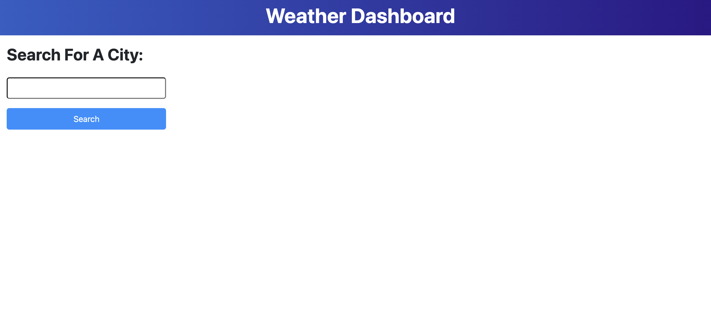
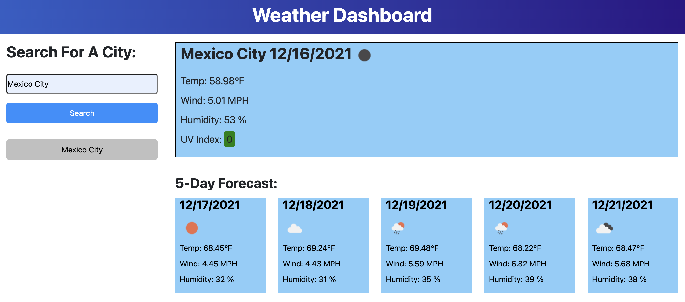

# u6-hw-server-side-api-weather-dashboard
ITESM Coding Bootcamp - Unit 6 Homework - Server-Side APIs: Weather Dashboard

This was a Job-Seeking coding assessment where I was required to build a Weather Dashboard. In this application the user types the name of a city in the input field and clicks the Search button. If the input does not match a valid city name an alert window is shown, asking the user to choose a valid name. Then, using the OpenWeather Server-Side APIs the application retrieves current weather and 5 day weather forecast information for the city entered by the user. After that, the application selects specific information (city name, weather icon, temperature, wind speed, humidity and UVI) to display in the current weather and forecast sections. In the case of the UVI the website shows a color code for favorable (green), moderate (yellow) or severe (red) conditions. To show the dates for current day and 5 day forecast the application makes use of moment.js. For each city that the user searches a button is created and displayed on the webpage, if the user clicks the button the weather information for that city is displayed again. A maximum of 8 history buttons can be stored, and if the user reloads the application this buttons are still there, using the browser's local storage.

For this activity I started by writing all the HTML code setting up links for libraries like bootstrap, google fonts, font awesome, moment.js and jQuery. In the end I only used google fonts and moment.js, specially because I wanted to make all the application with my own classes, CSS properties and vanilla JS (to practice more on my coding skills with each language). For the HTML I used semantic elements, id and class attributes. 

After that I wrote the CSS code to give style to the website, resembling the mock-up provided. I made extensive use of flexbox to set the different sections of the website and to see how all the elements should look to be as close as possible to the mock-up. 

Then, I worked on the JavaScript code. First, I declared some variables, assigning them values that would make use of the DOM to be able to manipulate all the different HTML elements. After that I set an event listener with a click event that takes the city name entered by the user and calls the OpenWeather API using the fetch() API. With the information retrieved I declared more variables assigning to them the specific information I would need to display in the current weather and forecast sections. 

Now, for the current weather section I used the DOM to insert the necessary information using mainly textContent on existing HTML elements. For the UVI color code I simply used some if statements. 

On the other hand, for the 5 day forecast section I opted to implement a for loop using the DOM to create all the elements I would need with the required information (I used the initial HTML code as a kind of blueprint for this).

To make the website appear more interactive I also used the visibility hidden property in CSS. When the user clicks the search button that property for the current weather and forecast section is changed to visible.

Following that, I used localStorage to set each city searched by the user in an empty array under the key of "cities" in the browser's local storage. I used that array to create the corresponding history button for each city (for this part I made use of appendChild, insertBefore, replaceChild and hasChildNodes, with some if statements). 

After this, I created another click event but with parent delegation on the history div element. Using event.target each of the history buttons calls the OpenWeather API again and sets all the required information on the website once again. 

Finally, I made an init() function using localStorage. If there is an array for the key "cities" in the browser's local storage when the page is reloaded, then the history buttons for those cities are created and displayed in the website. If the user clicks them the weather information for the corresponding button is displayed. 

The final website looks like this when it is loaded for the first time:

When the weather information for a city is displayed it looks like this:

The link for the deployed application is this:

https://josevidmal.github.io/u6-hw-server-side-api-weather-dashboard/

Technologies used:

* HTML
* CSS
* JavaScript
* Web APIs
* Server-Side APIs (OpenWeather API: https://api.openweathermap.org)
* Moment.js
* Google Fonts

Contact information:

* José Vidal
* email: josevidmal@gmail.com

License:

This project is licensed under the terms of the MIT license.